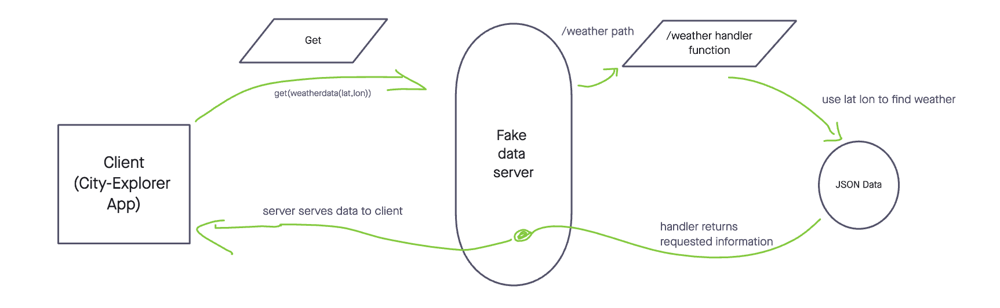

# City-Explorer API

**Author**: Joseph Streifel

**Version**: 1.0.0

## Overview

API hosted on Heroku at: [https://city-explorer-api-js.herokuapp.com/](https://city-explorer-api-js.herokuapp.com/)

Designed to be used in tandem with [City Explorer](https://city-explorer-js.netlify.app/) application. Will serve data about an area, based on user location search!

## Getting Started

**Dependencies**: cors, dotenv, express, axios

Ensure that `npm i` is run upon cloning project.

Set **environmental variables** before attempting to use server:

* `PORT` - the port that the server will serve from.
* `WEATHER_API_KEY` - string representing a key from [Weatherbit.io](https://www.weatherbit.io/)
* `MOVIE_API_KEY` - string representing a key from [themoviedb.org](https://developers.themoviedb.org/3/getting-started/introduction)

## Architecture

* Technologies:
  * Node.js
  * JavaScript
* Libraries:
  * cors
  * dotenv
  * express
  * axios

## Change Log

11-02-21 05:25 PM - Server spun up and local port proof of life completed successfully!
11-02-21 09:03 PM - Server is serving appropriate data array based on user search query!
11-02-21 10:39 PM - Error handling setup for 404.
11-02-21 11:16 PM - Error handling for 500, 400, any other.
11-03-21 06:42 PM - Weather data is served from a live external API source.
11-03-21 08:07 PM - Movie data retrieval set up, serve to client successful.
11-03-21 11:47 PM - API hosted on Heroku

## Credit and Collaborations

Collaboration with [Ben Mills](https://github.com/akkanben) during the planning phase for the web request-response cycle.

## WRRC Breakdown

### 11-02

When utilizing this server, the client (city explorer app) will send a request for weather with query parameters attached. When the server see the `/weather` path it will take those parameters and retrieve matching data from static JSON stored in this repository. Upon retrieving data, the server manipulates it a bit to get just date and weather descriptions, before sending the response back to the client in the form of an array.

### 11-03

Our WRRC is getting a bit more complex. Our netlify app makes a request to an API that we've hosted on Heroku. That API looks at the path of the request, and forwards parameters accordingly to either TMDB API or WeatherBit.io API. The pinged API returns a response object, from which the heroku API grabs the data. The heroku API then cleans up the data and sends it back to our Netlify app, completing this WRRC.

## Feature Implementation Time Log

| Feature # | Feature Name | Estimated Time | Start Time | End Time | Total Time |
|-----------|--------------|----------------|------------|----------|------------|
| 1 | Set up server | 00:40 | 04:45 PM | 05:31 PM | 0:46 |
| 2 | Placeholder Weather | 01:30 | 05:41 PM | 09:00 PM | 03:19 |
| 3 | Error Handling | 01:00 | 09:10 PM | 11:16 PM | 02:06 |
| 4 | Live Weather | 01:30 | 05:47 PM | 06:42 PM | 00:55 |
| 5 | Movie Data | 02:00 | 06:55 PM | 09:08 PM | 02:13 |
